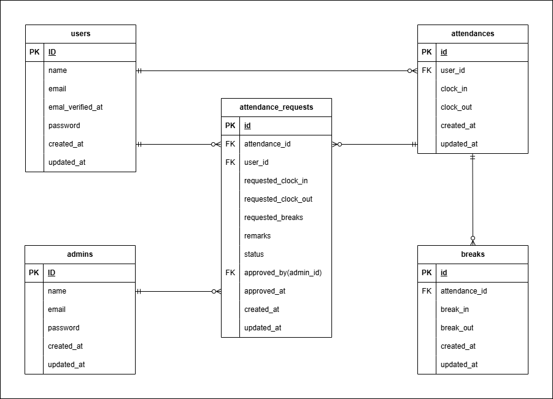

# 勤怠管理アプリケーション

> スタッフの勤怠を管理することができるWebアプリケーションです。
> 出勤・退勤・休憩・修正申請・承認までを一元管理します。

## 概要
- スタッフは勤務の出勤・退勤・休憩時間を記録することができます。
- スタッフは自身の勤怠記録を確認し、管理者へ記録の修正申請をすることができます。
- 管理者はスタッフの勤怠記録を確認し、修正することができます。また、スタッフからの修正申請を承認することができます。

## 主な機能

### スタッフユーザー
- ユーザー新規登録・ログイン・ログアウト  
  fortifyのメール認証機能を利用（メール確認にはMailHogを使用）  
- 一日の勤怠記録を登録  
  - 出勤・退勤は1日に付き1回のみ
  - 休憩は複数回登録可能  
- 1か月分の勤怠一覧を表示（年月の切り替えが可能）  
- 1日分の勤怠詳細を表示  
  - 同画面から管理者へ勤怠記録の修正申請が可能  
- 修正申請一覧を表示  
  - 「申請待ち」と「申請済み」をタブで切り替え可能  

### 管理者ユーザー
- ログイン・ログアウト（認証にはfortifyを使用）  
- 勤怠一覧を表示  
  当日に勤務しているスタッフの勤怠記録を一覧表示  
- 勤怠詳細を表示  
  任意のスタッフの1日分の勤怠詳細が確認可能  
- 勤怠記録の修正  
  勤怠詳細画面から勤怠記録の修正が可能  
- スタッフ一覧を表示  
- スタッフ別勤怠一覧を表示（年月の切り替えが可能）  
- スタッフ別勤怠一覧のCSV出力  
  - スタッフ別勤怠一覧画面から当該ユーザーの1か月分の勤怠記録をCSV出力可能  
  - excelで開いた際の文字化けを軽減するための対応を実装  
- スタッフからの勤怠記録修正申請の承認  
  - 一覧から申請を選択し、勤怠詳細を確認して承認可能  

## 使用上の制約
- 本アプリではUIを忠実に再現するため**日またぎ勤務の正確な表示および修正は想定していません。**
## 環境構築

### Dockerビルド
1. リポジトリをクローン  
コマンドライン上
```bash
git clone git@github.com:kumumuma05/work-attendance.git
cd work-attendance
```
2. コンテナの起動  
コマンドライン上
```bash
docker-compose up -d --build
```

### Laravel 環境構築
1. PHPコンテナへ入る  
コマンドライン上
```bash
docker-compose exec php bash
```
2. パッケージのインストール  
PHPコンテナ上
```bash
composer install
```
3. 環境ファイル作成  
PHPコンテナ上
```bash
cp .env.example .env
```
4. アプリキー作成  
PHPコンテナ上
```bash
php artisan key:generate
```
5. マイグレーション実行（初期データも同時投入）  
PHPコンテナ上
```bash
php artisan migrate --seed
```
> ※ 使用しているOSによってはファイル権限が原因でエラーが発生する場合があります。
>その際は環境に合わせて権限を調整してください。  

## ログイン情報
  本アプリではテスト用にseederで管理者用とスタッフ用のユーザーを登録しています。  
（開発環境での動作確認用であり、実際の利用時はユーザー自身が登録します）
- 管理者  
  名前：管理者  
  メールアドレス:admin@example.com  
  パスワード:password123
- スタッフ用ユーザー  
  名前：テスト太郎  
  メールアドレス:user@test.com  
  パスワード:password

## テスト実施要領
  本アプリではPHPUnitを用いたFeatureテストを用意しています。テストにはテスト専用のデータベースを使用しています。テスト実施手順は下記のとおりです。  
1. 準備（初回のみ）  
- MYSQL　コンテナに入る
```bash
docker-compose exec mysql bash
```
- MySQL にログイン（データベースの作成は権限の問題で管理者でログインする必要があります。）
```bash
mysql -u root -p
```
> ※パスワードはdocker-compose.ymlファイルに記載されているとおり「root」を入力する。
- テスト用データベースを作成
```sql
CREATE DATABASE demo_test;
```
- MYSQLコンテナから出る
- テスト用マイグレーション実行(初期データも同時投入)  
PHPコンテナ上
```bash
php artisan migrate --seed --env=testing
```
> ※ この作業はテスト用データベースを初期構築する初回のみ（テスト実行時はRefreshDatabaseにより毎回リセットされます）
2. テスト実施  
PHPコンテナ上
```bash
php artisan test
```

## 使用技術

- PHP 8.1-fpm  
- Laravel 8.83.29  
- MySQL 8.0.26  
- Nginx 1.21.1  

## ER図



## URL

### スタッフ側
| 機能 | URL |
|------|------|
| ユーザー登録 | http://localhost/register/ |
| 勤怠登録（勤怠トップ）| http://localhost/attendance/ |
### 管理者側
| 機能 | URL |
|------|------|
| 勤怠一覧 | http://localhost/admin/attendance/list |
### その他
| 機能 | URL |
|------|------|
| phpMyAdmin | http://localhost:8080/ |
